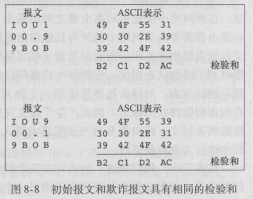
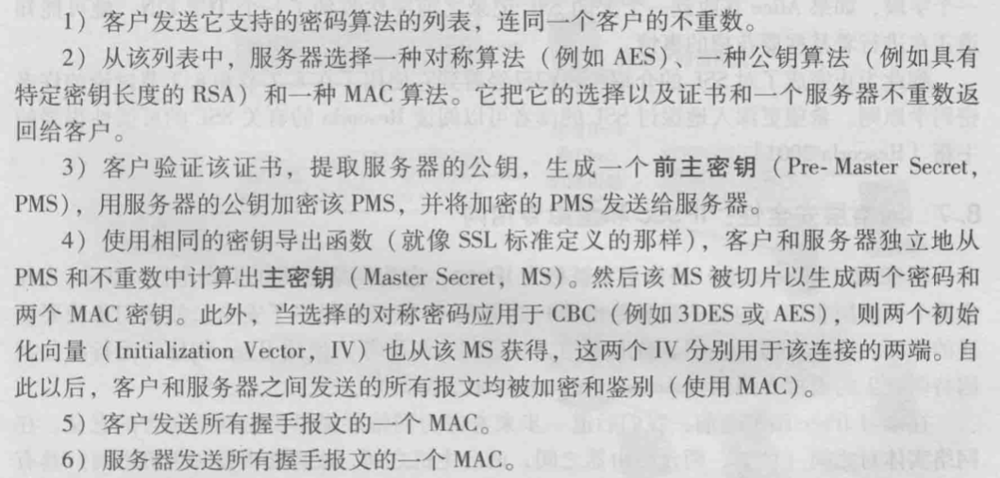
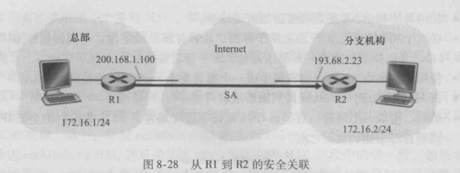
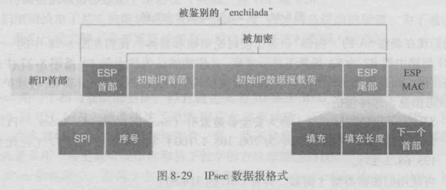
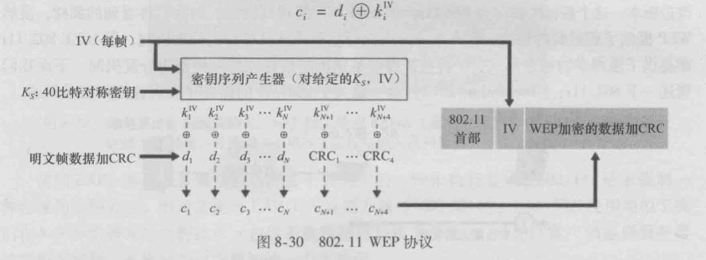

# 第八章 计算机网络中的安全

## 复习题

### 8.1节 什么是网络安全

1. 报文机密性和报文完整性之间的区别是什么？你能具有机密性而没有完整性吗？你能具有完整性而没有机密性吗？证实你的答案。

   - 机密性：仅有发送方和希望的接收方能够理解传输报文的内容，要求报文在一定程度上进行加密，使截获的报文无法被截获者所理解。
   - 完整性：接收方可以确保其通信的内容在传输过程中未被恶意篡改或者意外改动。

   两者是不同的概念，可以只有其一。如：加密后的报文如果被篡改后，还是具有机密性（因为攻击者不能知道明文），而不具备完整性（如果没有检测出变化）。又或者明文的报文被篡改（检测出），不具有机密性。

2. 因特网实体（路由器、交换机、DNS 服务器、Web 服务器、用户端系统等）经常需要安全通信。给出三个特定的因特网实体对的例子，它们要安全通信。

   - 用户的个人电脑和网站服务器
   - 两台路由器之间的通信
   - 两个DNS域名服务器之间的通信

### 8.2节 密码学的原则

3. 从服务的角度，对称密钥系统和公开密钥系统之间一个重要的差异是什么？

   答：对称密钥系统中发送方和接收方需要知道相同的密钥（秘密的），而公开密钥系统中加密和解密的密钥是不同的。一个密钥为全世界所知（用于加密），另一个密钥只有接收方知道（用于解密）。

4. 假定某入侵者拥有一个加密报文以及该报文的解密版本。这个入侵者能够发起已知密文攻击、已知明文攻击和选择明文攻击吗？

   答：入侵者能够发起已知明文攻击。如果攻击者能够通过某种办法来控制发送方加密的明文，此时可以发起选择明文攻击。

5. 考虑一个 8 块密码。这个密码有多少种可能的输入块？有多少种可能的映射？如果我们将每种映射视为一个密钥，则该密码具有多少种可能的密钥？

   答：输入块有2^8种可能，有2^8!种可能的映射没有映射视为一种密钥，则有2^8!种可能的密钥。

6. 假定 N 个人中的每个人都和其他 N-1 个人使用对称密钥密码通信。任两人（i 和 j）之间的所有通信对该 N 个人的组中的所有其他人都是可见的，且该组中的其他人都不应当能够解密他们的通信。则这个系统总共需要多少个密钥？现在假定使用公开密钥密码。此时需要多少个密钥？

   - 对称秘钥密码通信需要$C^2_N$个密钥对，即$C^2_N$个密钥。
   - 公开密钥密码只需要每人有自己的公钥和私钥，即2N个密钥。

7. 假定 n=10000、a=10023 和 b=10004。请你使用等同的模算术来心算（a・b) mod n

   答：因为a mod n=23, b mod n=4,所以（a・b) mod n=(23*4) mod n = 92. 

8. 假设你要通过加密对应于报文 10101111的十进制数来加密该报文。该十进制数是什么

   答：175

### 8.3~8.4节 报文完整性和数字签名+端点鉴别

9. 散列以何种方式提供比检验和（如因特网检验和）更好的报文完整性检验？

   答：散列要求对于给定的报文M，要找到一个M‘使得M与M’的消息摘要相同时计算上不可能的，这种性质意味着入侵者在计算上不可能用其他报文替换由散列函数保护的报文，即入侵者不可能伪造报文的内容，使得该报文与原报文具有相同的散列值。而对于校验和来说，可以轻易的找到两个报文具有相同的校验和，如图8-8所示。

   

10. 你能够“解密”某报文的散列来得到初始报文吗？解释你的答案。

    答：不能，因为散列是单向函数。也就是说对于任意给定hash值h=H（m），不能得出原始消息m。

11. 考虑 MAC 算法（图 8-9) 的一种变形算法，其中发送方发送（m, H (m) +s），这里 H (m) +s 是 H (m）和 s 的级联。该变形算法有缺陷吗？为什么？

    

    答：有缺陷。攻击者可以通过嗅探从H(m)+s的最后几位得到共享密钥，然后假冒发送者伪造信息t=H(t)+s。

12. 一个签名的文档是可鉴别的和不可伪造的，其含义是什么？

    答：假设bob发送了一个加密的文档给Alice。可鉴别的是指Alice可以确信是Bob发送了这个加密文档，不可伪造的是指只有Bob可能发送这个加密文档。

13. 公钥加密的报文散列以何种方式比使用公钥加密报文提供更好的数字签名？

    答：公钥加密的报文散列好处在于只需要对报文的摘要进行加密，而不需要加密整个报文。因为公钥加密算法如RSA的开销比较大，所以我们更希望签名更小的数据。

14. 假设 certifier.com 生成一个用于 foo.com 的证书。通常整个证书将用 certifier.com 的公钥加密。这种说法是正确还是错误？

    答：错误。由certifier.com颁发的证书包含一个数字签名，由foo.com的信息组成（包括foo.com的公钥），然后使用certifier的私钥进行签名。

15. 假设 Aice 有一个准备发送给任何请求者的报文。数以千计的人要获得 Aice 的报文，但每个人都要确保该报文的完整性。在这种场景下，你认为是基于 MAC 还是基于数字签名的完整性方案更为适合？为什么？

    答：基于数字签名的方案更合适。如果采用MAC，则Alice需要和每一个接受者共享一个secret；而采用数字签名时，Alice只需要使用自己的私钥对报文进行签名即可。

16. 在某端点鉴别协议中，使用不重数的目的是什么？

    答：不重数(nonce)是在一个协议的生存期中只使用一次的数。使用不重数是为了防御重放攻击(reply attack)。

17. 我们说一个不重数是一个在生存期中只使用一次的值，这意味着什么？其中是指谁的生存期？

    答：发送不重数的一方不会使用相同的数来确认对方是否“存活”。

18. 基于 HMAC 的报文完整性方案易受重放攻击影响吗？如果是，能够在方案中综合一个不重数来去除这种脆弱性吗？

    答：容易（只对消息和密钥做哈希）。可以用s级联m和一个不重数，然后计算散列来去除重放攻击脆弱性。

### 8.5~8.8节 安全电子邮件+SSL+IPsec+无线LAN安全

19. 假定 Bob 从 Aice 处接收一个 PGP 报文。Bob 怎样才能确定 Aice（而不是如 Trudy）生成了该报文？PGP 为保证报文完整性使用了 MAC 吗？

    答：Alice提供了数字签名从而Bob可以鉴别。PGP报文完整性是由数字签名提供的。

20. 在 SSL 记录中，有一个字段用于 SSL 序号。这种说法是正确还是错误？

    

    答：错误。SSL隐式的使用序号，即发送方并不实际在记录中包括一个序号，但当他计算MAC时，他把该序号包括在MAC中。

21. 在 SSL 握手中随机不重数的目的是什么？

    答：防止重放攻击。

22. 假设某 SSL 会话应用了具有 CBC 的块密码。服务器以明文向客户发送了 IV。这种说法是正确还是错误？

    答：正确。IV在SSL握手过程以明文形式发送。

23. 假设 Bob 向 Tudy 发起一条 TCP 连接，而 Trudy 正在伪装她是 Aice。在握手期间，Tudy 向 Bob 发送 Aice 的证书。在 SSL 握手算法的哪一步，Bob 将发现他没有与 Aice 通信？

    SSL握手步骤：

    

    答：在生成前主密钥后（PMS），Bob会使用Alice的公钥加密PMS，并发送给Trudy。由于Trudy没有Alice的私钥，所以Trudy不能从PMS中计算出主密钥，从而切片生成两个密码和两个MAC密钥。所以Trudy只能猜测一个MAC密钥。在SSL握手的最后一步中，Trudy需要发送所有握手消息的MAC给Bob，而此时Bob验证会发现MAC验证失败，从而终止通信。

24. 考虑使用 Ipsec 从主机 A 向主机 B 发送分组流。通常，为该流中的每个发送分组将创建一个新 SA。这种说法是正确还是错误？

    答：错误。通常来说会先在主机A和主机B之间创建一个安全关联（SA），之后分组流都是用此SA。

25. 假设在图 8-28 中总部和分支机构之间通过 Ipsec 运行 TCP。如果 TCP 重新传输相同的分组，则由 R1 发送的两个对应的分组将在 ESP 首部中具有相同的序号。这种说法是正确还是错误？

    

    

    答：ESP首部中包含SPI字段和序号字段。SPI字段指示接收实体该数据报属于哪个SA，序号字段用于防御重放攻击。题目这种说法是错误的，因为IPsec每发送一个包就会增加一次序号字段。

26. IKE SA 和 Ipsec SA 是相同的东西。这种说法是正确还是错误？

    答：错误。IKE（因特网密钥交换协议）SA是为了建立一个或多个IPsec SA。

27. 考虑 802.11 的 WEP。假定数据是 10101100 并且密钥流是 11110000 相应的密文是什么？

    答：WEP（有线等效保密）中数据与与密钥流异或得到密文，所以密文是01011100。

    

28. 在 WEP 中，在每个帧中以明文发送IV。这种说法是正确还是错误？

    答：正确，IV值在该帧中以明文形式传输，窃听者能发现何时使用了一个重复的IV值。

### 8.9节 防火墙和入侵检测系统

29. 状态分组过滤器维护两个数据结构。给出它们的名字并简单地讨论它们做些什么。

    答：连接表和filter table。连接表跟踪连接来更好的进行包过滤。

30. 考虑某传统的（无状态的）分组过滤器。该分组过滤器可能基于 TCP 标志位以及其他首部字段过滤分组。这种说法是正确还是错误？

    答：正确。

31. 在传统的分组过滤器中，每个接口能够具有自己的访问控制表。这种说法是正确还是错误？

    答：正确。路由器的每个接口都有自己的访问控制表。

32. 为什么应用程序网关必须与分组过滤器协同工作才能有效？

    答：如果不和分组过滤器协同工作，则机构内部的用户能和机构外部的主机直接相连。分组过滤器使用户首先连接到应用程序网关。

33. 基于特征的 IDS 和 IPS 检查 TCP 和 UDP 报文段的载荷。这种说法是正确还是错误？

    答：正确。IDS和IPS执行深度分组检查能查看首部字段以外部分。
